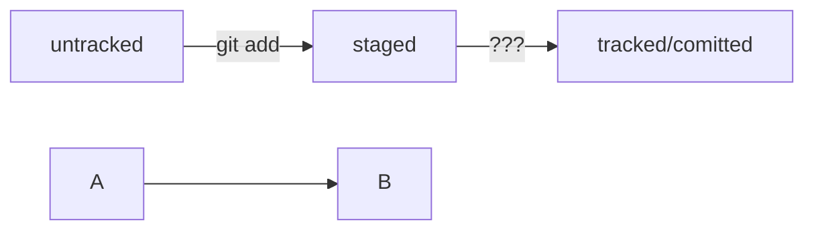

# Подсказки по GIT
---

#### Git
git init - создание репозитория
git add - выбрать файлы для сохранения (--all все файлы)
git status - состояние репозмтория
*rm .git - удалить репозиторий*
git commit -m "comment" сохранить изменения
git log - посмотреть историю коммитов

#### Генерация SSH
ssh-keygen -t ed25519 -C "Email привзянный к GitHUB"
или 
ssh-keygen -t rsa -b 4096 -C "Email привзянный к GitHUB"
* passphrase можно не указывать поначалу - это пароль на ключ )

#### Добавление ключкй в GitHub
Копирование ключей .pub
Перейти в папку cd ~/.ssh
открыть файл cat *.pub
Скопировать содержимое
Вставить в GitHub -> Settings -> SSH and GPG Keys -> New SSH Key:
Title: название ключа
Key Type: Authentication Key
Key: Вставить из буфера скопированный ключ
нажать ADD SSH key

Проверить ключ: ssh -T git@github.com
Убедиться, что репозитории связаны: git remote -v

#### Привязать репозиторий
cd ~/dev/first-project/
git remote add origin git@github.com:roadot/ya-git-manual-1.git
roadot -  логин поставить свой
ya-git-manual-1.git - назвпние репозитория в GitHub

#### Отправить репозиторий на GitHub
git push -u origin main - первый раз делается, потом git push


Блоки кода в маркдауне начинаются и заканчиваются тремя символами ```. После первых трёх ``` можно указать, какой именно код будет внутри блока. Например: ```mermaid , ```bash, ```python, ```javascript и так далее. Если ничего не указать, GitHub будет считать весь код простым текстом.

Два символа %% обозначают в mermaid строку-комментарий.
Чтобы сделать схему, нужно указать формат: graph LR. Graph — это простейший тип схем; для шпаргалки его будет достаточно.
Чтобы добавить элементы и связи (стрелки), используют строки вида A --> B. Такая строка создаст квадратные блоки А и B и соединит их стрелкой.

Дополнительно можно указывать текст на стрелке. Например, так: A -- "text" --> B.
Ниже вы найдёте заготовку для схемы статусов файлов.


~~~ mermaid
%% описание схемы
~~~
